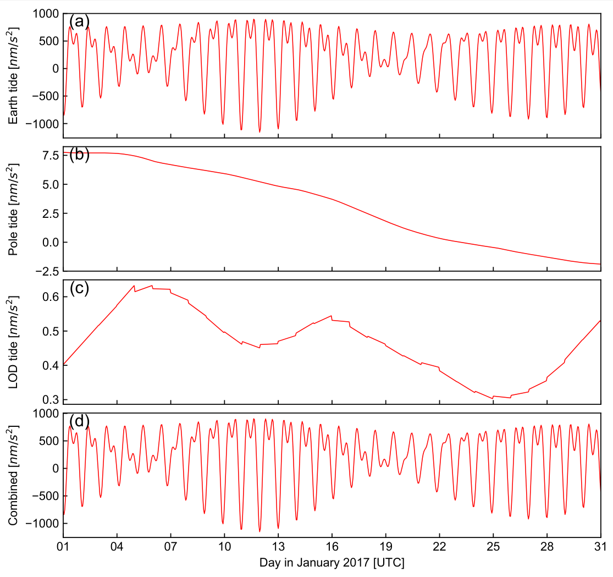

# Quickstart

This page gets you from zero to a plotted Earth-tide time series in a few lines of code. It assumes PyGTide is already [installed](installation.md).

## 1. The fastest way: one function call

```python
from pygtide import predict_series

# latitude, longitude, height, startdate, duration [h], samprate [s]
args = (49.00937, 8.40444, 120, '2018-01-01', 24 * 7, 3600)
series = predict_series(*args)
print(series[:5])
```

This returns a NumPy array with hourly gravity tides (in nm/s²) for Karlsruhe, Germany, covering the first week of January 2018.

## 2. The full class interface

For anything beyond a plain series, use the `pygtide` class:

```python
import datetime as dt
import pygtide

# create a PyGTide object
pt = pygtide.pygtide()

# define location (Karlsruhe), start, duration [h] and sampling rate [s]
lat, lon, height = 49.00937, 8.40444, 120
start = dt.datetime(2018, 1, 1)
duration = 24 * 7
samprate = 3600

# run ETERNA PREDICT
pt.predict(lat, lon, height, start, duration, samprate)

# retrieve the results as a pandas DataFrame
data = pt.results()
print(data.head())
```

Typical output:

```text
                       UTC  Signal [nm/s**2]  Tide [nm/s**2]  Pole tide [nm/s**2]  LOD tide [nm/s**2]
0  2018-01-01 00:00:00+00:00        -59.030874      -59.037534            0.005357           0.001303
1  2018-01-01 01:00:00+00:00        -11.233151      -11.239811            0.005357           0.001303
...
```

The columns are:

| Column | Meaning |
|---|---|
| `UTC` | Time stamp (timezone-aware, UTC) |
| `Signal [unit]` | Total model tide including pole and LOD tide corrections |
| `Tide [unit]` | Pure body-tide signal without corrections |
| `Pole tide [unit]` | Contribution from polar motion (zero if disabled) |
| `LOD tide [unit]` | Contribution from length-of-day variations (zero if disabled) |



*Illustrative gravimetric Earth tide built from the main tidal constituents — your `predict_series` result for the same location will look similar.*

## 3. Quick plot

```python
from pygtide import plot_series, plot_spectrum

args = (49.00937, 8.40444, 120, '2018-01-01', 24 * 30, 600)
plot_series(*args)    # time series
plot_spectrum(*args)  # amplitude spectrum
```

## 4. Useful things to know right away

> [!NOTE]
> All input and output times are **UTC**. To convert the results to local time:
>
> ```python
> data['UTC'] = data['UTC'].dt.tz_convert('Europe/Berlin')
> ```

> [!IMPORTANT]
> The default gravity output is a **rigid-Earth (geometric) tide**. To obtain body-tide gravity, scale the wave group, e.g. `pt.set_wavegroup(np.asarray([[0, 10, 1.16, 0]]))`. Background and recipes: [Background — Absolute scale](background.md#absolute-scale-of-the-output).

> [!WARNING]
> Gravity tides (the default, `tidalcompo=0`) are in **nm/s², positive downwards**. Other components use different units and sign conventions — see the [component table](configuration.md#earth-tide-components-tidalcompo).

## Next steps

- [Usage Guide](usage.md) — components, wave groups, corrections, worked examples
- [Configuration](configuration.md) — full parameter reference
